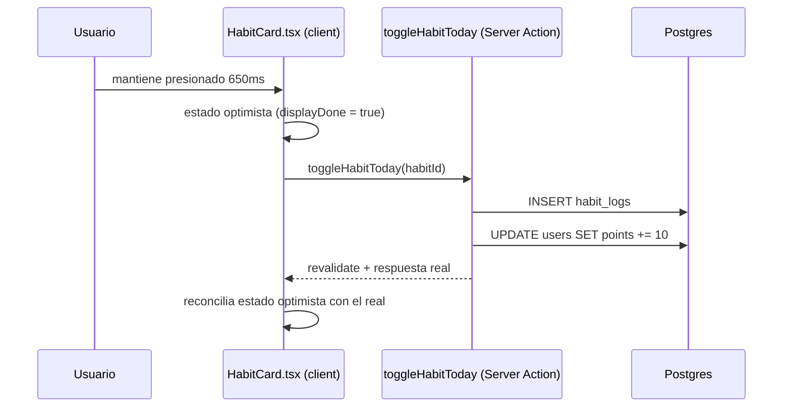

# Arquitectura

## Vista general

EJECUTA es un monolito Next.js 14 (App Router) — no hay backend separado ni
API pública. El navegador pide una página, el servidor la arma leyendo
Postgres directamente, y las mutaciones son Server Actions ejecutadas en el
mismo proceso, no llamadas a un API REST propio.

```mermaid
flowchart LR
  Browser["Navegador"] -->|GET página| Next["Next.js App Router\n(Server Components)"]
  Browser -->|Server Action\n(marcar hábito, guardar ejercicio)| Next
  Next -->|Drizzle ORM| PG[("Postgres\n(Neon, vía Vercel)")]
  Next -->|NextAuth JWT| Auth["src/auth.ts"]
  Next -->|emails| Resend["Resend"]
  Next -->|push| WebPush["Web Push API"]
  Next -->|pagos| PayPal["PayPal API"]
  PayPal -->|webhook POST| Next
  Vercel["Vercel Cron\n(diario 13:00 UTC)"] -->|POST| Next
  Next -->|errores| Sentry["Sentry"]
```

## Frontend

- **Next.js 14, App Router**, React 18, TypeScript estricto.
- **Server Components por defecto** — la mayoría de `src/app/**/page.tsx`
  son `async function` que consultan la base directamente (via
  `src/lib/queries.ts`) y renderizan HTML en el servidor. No hay
  `useEffect` + `fetch` para cargar datos iniciales.
- **Client Components** (`"use client"`) solo donde hace falta estado o
  interacción: formularios, toggles (`DensityToggle`, `GrainToggle`),
  juegos interactivos de los módulos (`*Game.tsx`), el canvas del jardín
  zen (`ZenGarden.tsx`).
- **Tailwind CSS** para todo el estilo, sin librería de componentes UI. Las
  clases compartidas (`.card`, `.btn-primary`, `.list-row`, etc.) viven en
  `src/app/globals.css`. Ver [`docs/design-system.md`](design-system.md).
- **PWA**: `public/manifest.webmanifest` + `public/sw.js` (Service Worker)
  + `RegisterServiceWorker.tsx` — instalable, con página offline
  (`public/offline.html`) y soporte de Web Push.

## Backend

No existe un backend separado — la "capa de backend" son:

1. **Server Components** que leen datos (`src/lib/queries.ts`).
2. **Server Actions** que escriben datos (`src/lib/*-actions.ts`), llamadas
   directo desde formularios o `onClick` en componentes cliente.
3. **6 rutas API reales** (`src/app/api/**/route.ts`) — solo donde un
   Server Action no puede aplicar porque el caller no es la propia app:
   - `api/auth/[...nextauth]` — NextAuth.
   - `api/cron/reminders` — Vercel Cron (recordatorios diarios).
   - `api/habits/[id]/check` — llamado desde el Service Worker (una
     notificación push necesita un endpoint HTTP real, no un Server Action).
   - `api/reminders/unsubscribe` — link de "darse de baja" en emails.
   - `api/webhooks/paypal` — PayPal llama esto, no el navegador del usuario.
   - `api/setup/migrate` — respaldo manual para correr migraciones.

Ver [`docs/api.md`](api.md) para el detalle de cada una.

## Base de datos

**Postgres** (Neon, vía la integración de Vercel Postgres) + **Drizzle
ORM**. `src/db/schema.ts` es la fuente de verdad — 10 tablas, todas
relacionadas a `users` por `user_id` con `ON DELETE CASCADE`. Ver
[`docs/database.md`](database.md) para el detalle completo y el diagrama ER.

Las migraciones (`drizzle/*.sql`) se generan con `npm run db:generate` y
corren solas en cada deploy (`vercel-build` = `db:migrate && next build`).
Deben ser idempotentes — ver la regla dura en `CLAUDE.md`.

## APIs

No hay API pública de terceros. Las 6 rutas internas están documentadas en
[`docs/api.md`](api.md). Las Server Actions (la superficie de escritura
real de la app) también están ahí.

## Autenticación

**NextAuth v4** (`src/auth.ts`) con **Credentials Provider** — email +
contraseña, hash con `bcryptjs`, sesión con estrategia **JWT** (sin tabla
de sesiones en la base). El login tiene rate limiting propio (por
IP+email y por IP a secas, ver `src/lib/rate-limit.ts`) contra fuerza
bruta y credential stuffing.

`src/lib/session.ts` expone `getCurrentUser()` / `requireUser()` — la
sesión JWT no revalida contra la base en cada request por defecto, así
que `getCurrentUser` chequea explícitamente que la cuenta siga existiendo
(protege contra una sesión válida de una cuenta ya borrada). Casi toda
página protegida empieza con `const user = await requireUser()`.

`middleware.ts` protege por matcher las rutas de app autenticada
(`/dashboard`, `/habits`, `/wheel`, `/modules`, `/onboarding`,
`/leaderboard`, `/cuenta`, `/upgrade`) — redirige a `/login` si no hay
sesión.

## Servicios externos

| Servicio | Para qué | Sin configurar... |
|---|---|---|
| **Neon (Postgres)** | Toda la data de la app | La app no arranca |
| **PayPal** | Trial + suscripciones (mensual/anual) | No se puede cobrar |
| **Resend** | Reset de contraseña, recordatorios diarios | Los emails se imprimen en el log del servidor |
| **Sentry** | Errores de producción | No hay visibilidad de errores, no rompe nada |
| **Web Push (VAPID)** | Notificaciones push | Se salta en silencio, los recordatorios siguen por email |
| **Google Search Console** | Verificación de dominio | No afecta la app, solo SEO |
| **Meta Pixel** | Ads (opcional) | El pixel no se renderiza, no-op |

## Flujo de datos: ejemplo completo (marcar un hábito)



## Explicación por módulo (`src/lib/`)

- `queries.ts` — todas las lecturas de la base, sin lógica de negocio.
- `*-actions.ts` — Server Actions (escritura): `habit-actions.ts`,
  `onboarding-actions.ts`, `module-actions.ts`, `wheel-actions.ts`,
  `account-actions.ts`, `password-reset-actions.ts`, `push-actions.ts`,
  `feedback-actions.ts`, `achievement-actions.ts`, `paypal-actions.ts`.
- `cycle.ts` / `cycle-state.ts` — lógica pura del ciclo de formación de 30
  días (días ejecutados, fallos, reset de puntos). Testeado
  (`cycle.test.ts`).
- `leveling.ts` — curva de puntos → nivel. Testeado (`leveling.test.ts`).
- `habit-utils.ts` / `habit-stats.ts` — cálculo de rachas, streaks,
  mejores rachas. Testeados.
- `habit-suggestions.ts` — sugerencias de hábito ancla según áreas de vida
  + puntaje inicial del Radar de Vida. Testeado.
- `modules-content.ts` — contenido de los 11 módulos (teoría, ejercicios,
  mantras). Testeado por integridad de datos (`modules-content.test.ts`).
- `access.ts` — lógica de acceso (trial activo / suscripción activa /
  cancelado-pero-dentro-del-período-pagado).
- `achievements.ts` — definición de logros y tiers.
- `subscription-plans.ts` — precios y features de los planes.
- `paypal.ts` — cliente HTTP hacia la API de PayPal (sandbox/live según
  `PAYPAL_ENV`).
- `rate-limit.ts` — rate limiting en memoria (por proceso, no distribuido).
- `analytics.ts` — tracking first-party del embudo de producto.

## Rituales (celebraciones a pantalla completa)

Un patrón propio del proyecto: `ArrivalRitual`, `ModuleUnlockedRitual`,
`AchievementUnlockedRitual`, `CycleCompletionRitual`, `ResetReentryRitual`,
`SubscriptionActivatedRitual` — cada uno es una pantalla completa que
celebra un momento (llegar al día, desbloquear un módulo, ganar un logro,
etc.). `src/app/dashboard/page.tsx` decide cuál mostrar con una cadena de
prioridad explícita (solo uno por visita) — ver el código para el orden
exacto si necesitas agregar un ritual nuevo.
