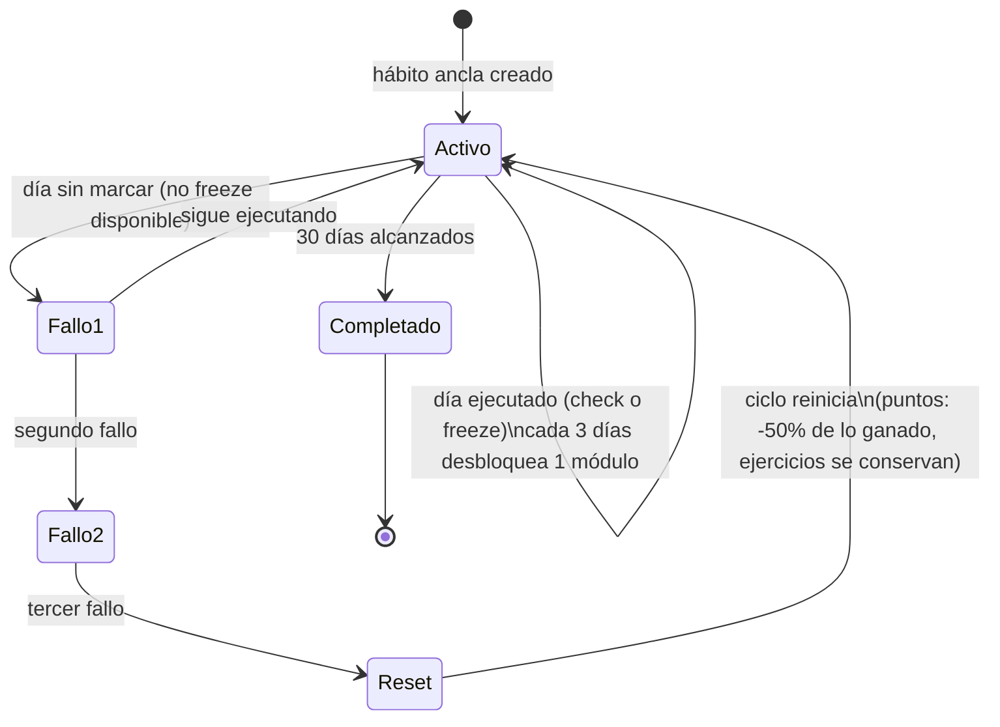

# Flujos de usuario

## 1. Registro → Onboarding → Primer hábito

**Objetivo**: llevar a alguien de "no tiene cuenta" a "tiene su hábito
ancla activo y sabe qué hacer hoy".

**Pantallas**: `/register` → `/onboarding` (paso 1: áreas, paso 2: Wheel
of Life inicial) → Módulo 1 (`/modules/por-que-fallas`, donde se elige el
hábito ancla como parte del ejercicio) → `/dashboard`.

```mermaid
flowchart TD
  A[/register/] -->|cuenta creada| B[/onboarding paso 1\nelige hasta 3 áreas/]
  B --> C[/onboarding paso 2\nWheel of Life inicial/]
  C -->|ConfirmDialog: "no se puede editar después"| D[Módulo 1]
  D -->|elige hábito ancla como ejercicio| E[/dashboard/]
  E -->|trial de 7 días arranca| F[Ciclo de 30 días arranca\ncon el hábito ancla]
```

**Decisiones clave**: el Wheel of Life inicial es irreversible una vez
confirmado (es la línea base para medir progreso real). El primer hábito
NO se crea en un formulario aparte — se elige como parte del ejercicio
del Módulo 1, a propósito, para que no sea una decisión aislada de la
educación que la precede.

**Errores/casos límite**: si el usuario abandona a mitad de onboarding y
vuelve, `getUserPreferences` devuelve `null` y cualquier página protegida
lo redirige de vuelta a `/onboarding`. Si intenta acceder a `/modules/[id]`
de un módulo distinto al primero sin haber completado el anterior, se
redirige a `/modules`.

## 2. Ciclo de formación de 30 días

**Objetivo**: que el contenido del curso se desbloquee con ejecución
real, no con tiempo.



**Estados**: `evaluateCycle()` (`src/lib/cycle-state.ts`) calcula esto en
cada carga de `/dashboard` — no hay un cron que "avance" el ciclo, se
recalcula on-demand desde `cycleStartedAt` y los `habit_logs`/`habit_freezes`
reales.

**Casos límite**: un `habit_freeze` cuenta como día ejecutado pero no
como "check" — protege la racha visible sin fingir que el hábito se
hizo. El reset preserva `exerciseData` de módulos ya completados a
propósito (re-ganar un módulo ya escrito es rápido).

## 3. Marcar un hábito hoy

**Objetivo**: el loop diario central de la app.

**Pantallas**: `/dashboard` (Hoy) — `HabitCard` por cada hábito activo.

**Flujo**: mantener presionado el botón 650ms → vibración táctil (si el
dispositivo soporta) → Server Action `toggleHabitToday` → `habit_logs`
INSERT + `users.points += 10` → si la racha resultante es un milestone
(7/14/30...), overlay de celebración dentro de la misma tarjeta.

**Estados**: optimista en el cliente (el check se ve al instante, antes
de que el servidor confirme) — se reconcilia si el servidor devuelve
algo distinto (ej. offline y la Server Action falla).

**Errores**: un doble-tap accidental justo después de completar el hold
no dispara "deshacer" — hay un guard de 400ms (`completedAt.current`)
para el click fantasma que el navegador dispara tras soltar el pointer.

## 4. Wheel of Life — medición periódica

**Objetivo**: la única fuente de verdad de "¿esto está funcionando de
verdad?" — no autoreporte de sensación, sino un número comparable cada
30 días.

**Pantallas**: `/wheel`.

**Flujo**: la primera medición ocurre en onboarding; después,
`canMeasureWheel` se habilita solo cuando pasaron ≥30 días desde la
última. El radar compara la medición actual contra la anterior y genera
un insight de una línea con la mejora más grande.

**Casos límite**: si aún no puede volver a medir, se muestra cuándo sí
podrá (`relativeDayLabel`) en vez de ocultar la sección entera.

## 5. Suscripción (trial → pago)

**Objetivo**: convertir el trial de 7 días en una suscripción activa sin
fricción, con PayPal como único método de pago.

```mermaid
flowchart LR
  A[Onboarding completa] -->|trialEndsAt = +7 días| B[Trial activo]
  B -->|se suscribe antes de vencer| C[Precio "descuento"\nbloqueado permanente]
  B -->|vence sin suscribirse| D[/upgrade bloqueado\nsolo precio "normal"/]
  C --> E[subscriptionStatus = active]
  D -->|se suscribe| E
  E -->|cancela| F[canceled, pero activo\nhasta subscriptionCurrentPeriodEnd]
  F -->|pasa la fecha| G[expired — acceso bloqueado]
```

**Decisiones clave**: el tier de precio ("descuento" vs "normal") se fija
para siempre en el momento de suscribirse — nunca cambia después aunque
cambien los precios de lista. `hasActiveAccess()` (`src/lib/access.ts`)
es la única función que decide si alguien puede usar la app —
cualquier pantalla protegida la llama.

**Errores/casos límite**: el webhook de PayPal (`api/webhooks/paypal`)
es la única fuente de verdad del estado real de la suscripción — el
cliente nunca marca "activo" por su cuenta, solo refleja lo que el
webhook ya escribió.

## 6. Progreso de módulos y desbloqueo secuencial

**Objetivo**: 11 módulos, uno a la vez, con el Módulo 1 como única
excepción sin gate de ejecución (ahí se elige el hábito ancla, no puede
depender de tener uno ya).

**Estados**: `locked` (módulo anterior no completado, o gate de
ejecución del ciclo no cumplido) → `disponible` → `completado`.

**Casos límite**: completar un módulo dispara `ModuleUnlockedRitual` la
próxima vez que el siguiente se vuelve alcanzable — pero solo una vez
por módulo (`lastUnlockedModuleNotifiedId` en `users`), y cede el paso a
un ritual de mayor prioridad si coincide el mismo día (ver
`docs/architecture.md`, sección de Rituales).
